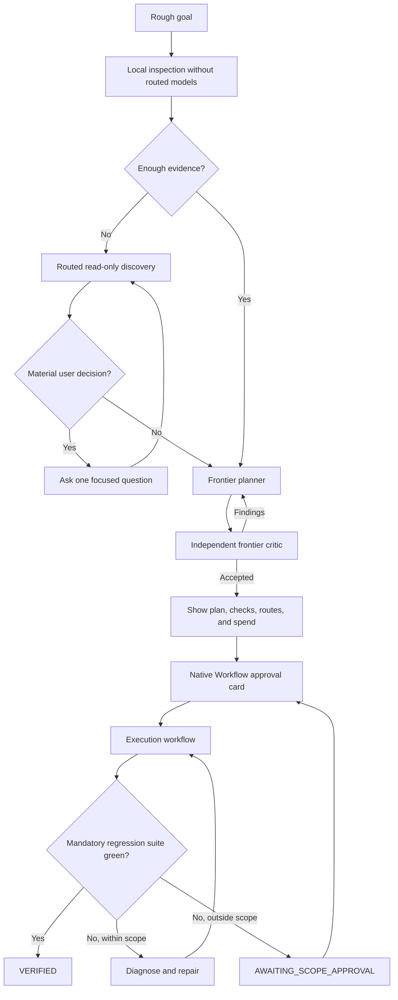
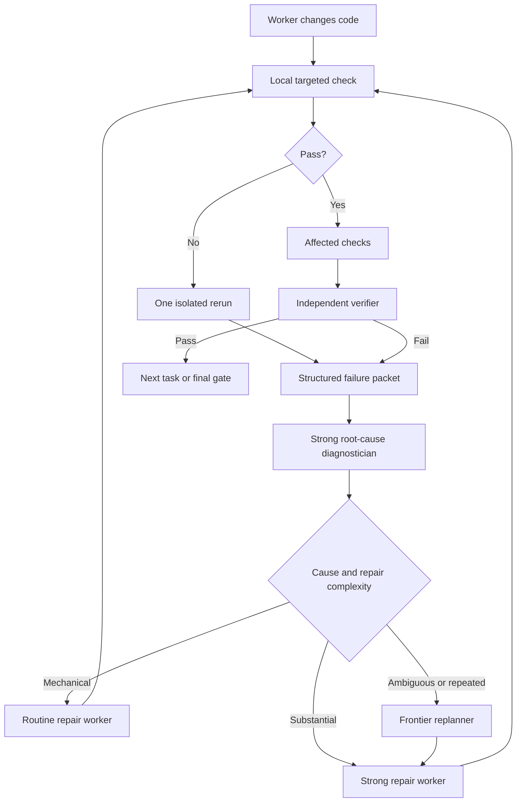

# Adaptive AI Router Start Workflow

Status: Accepted design  
Date: 2026-07-23

## Context

AI Router currently accepts a sufficiently precise task through
`/ai-router:workflow`, performs limited inspection in the main Claude session,
builds an execution plan, and launches a visible native Dynamic Workflow.
It does not yet provide a routed, interactive path from a rough goal through
discovery, planning, plan criticism, implementation, test-driven repair, and
acceptance.

The accepted design adds a single adaptive entry point while preserving the
existing workflow command as an expert fast path.

## Understanding summary

- The user starts with one rough software-development goal.
- The plugin first performs lightweight local inspection without routed model
  calls.
- Clear tasks skip routed discovery; ambiguous tasks use bounded, visible,
  read-only discovery agents.
- Every final implementation plan is created by a frontier planner and checked
  by an independent frontier critic from another provider.
- Only decisions that materially affect product behavior, architecture,
  security, cost, risk, or scope interrupt the user.
- Implementation starts after one native Workflow approval card.
- Test execution is deterministic and separated from model reasoning.
- The repository follows zero tolerance for test failures: no error is ignored
  because it is pre-existing or unrelated.

## Goals

1. Provide one adaptive entry point for rough and precise tasks.
2. Spend model tokens on semantic work rather than deterministic inspection,
   command execution, or log transport.
3. Make planning, model choice, effort, verification, testing, repair, and
   escalation inspectable.
4. Preserve one current worktree per session and allow many internal agents.
5. Continue through model failures while new evidence or approaches exist.
6. Require a completely green mandatory regression suite for `VERIFIED`.
7. Persist compact state so interrupted work can continue without repeating
   successful discovery or checks.

## Non-goals

- No per-project privacy classifications or provider policy files.
- No automatic account rotation, quota evasion, or credential reuse.
- No hidden model generations or retries.
- No artificial fixed cap on the number of useful agents.
- No automatic scope expansion outside an approved plan.
- No claim that Claude or Codex remaining subscription quota is observable.
- No additional worktree creation by the router.

## User interface

### Adaptive entry

```text
/ai-router:start <rough or precise software goal>
```

The command owns the planning lifecycle. It may inspect, dispatch discovery
agents, ask material questions, run frontier planning and criticism, present a
complete plan, and compile the execution workflow.

Typical progress:

```text
Inspecting locally…
Discovery required: yes
Running 3 discovery agents…
Waiting for one product decision…
Planning with Claude Best…
Critiquing with Codex Sol…
Plan ready.
```

### Existing commands

```text
/ai-router:workflow <precise software task>
```

Explicit expert fast path that skips adaptive discovery.

```text
/ai-router:doctor fresh
/ai-router:usage
```

Provider readiness and routed usage remain separate commands.

### Approval

The final plan is shown immediately before one native Workflow approval card.
That card is the only normal implementation confirmation. If execution later
discovers a required change outside the approved scope, a new card approves
only the additional scope.

## Lifecycle



## Planning phases

### 1. Local inspection

The controller uses local tools before routed models:

- canonical worktree and Git state;
- relevant source and documentation inventory;
- current diff and uncommitted baseline;
- CI, package, build, lint, and test configuration;
- available deterministic checks;
- recent local router health cache.

Local inspection may run diagnostic commands. It must not edit source files.
Build and cache artifacts produced by tests, builds, linters, or type checkers
are permitted.

### 2. Discovery decision

Discovery is skipped only when local evidence is sufficient to define:

- the expected artifact;
- bounded paths;
- relevant contracts and dependencies;
- deterministic acceptance checks;
- material risks and non-goals.

Otherwise the controller creates bounded discovery tasks. Deterministic search
stays local. Routine semantic inspection uses Haiku, Luna/low, MiniMax, or
direct DeepSeek. Cross-file or ambiguous inspection uses corporate LiteLLM,
Terra/medium, or Sonnet/medium.

### 3. Material questions

The controller asks the user only when a decision materially changes:

- product behavior;
- public or persistence contracts;
- architecture;
- security or privacy exposure;
- cost or premium routes;
- implementation scope or risk.

Answers available from the repository are not delegated to the user. Minor
decisions become explicit assumptions.

### 4. Frontier planning gate

Every final plan, including a plan that skipped routed discovery, uses:

1. one available frontier planner; and
2. one independent frontier critic from a different provider.

Selection is dynamic. Typical candidates are Codex Sol/high, Claude Opus/high,
and Claude Best/high. Claude Best resolves to Fable when the account has access
and otherwise to Opus.

The critic checks scope, architecture, dependencies, risks, test coverage,
model ladders, verification independence, and budget. Findings return to the
planner until the plan passes or a real blocker remains.

## Model routing by role

| Role | Default tier | Escalation |
|---|---|---|
| File search, Git metadata, test execution | Local deterministic tools | None |
| Mechanical log normalization | Local tools, then routine if needed | Strong when ambiguous |
| Bounded discovery | Routine | Strong |
| Cross-file semantic discovery | Strong | Frontier |
| Final planning | Frontier | Another frontier approach |
| Plan criticism | Independent frontier | Planner revision |
| Root-cause diagnosis | Strong | Frontier |
| Precisely diagnosed mechanical repair | Routine | Strong or frontier |
| Test-intent verification | Strong | Frontier for contract changes |
| Final acceptance | Deterministic regression plus independent verifier | Frontier repair/replan |

Within a tier, selection considers provider health, independent providers,
recent routed usage, configured budget, and rate-limit evidence. Corporate
LiteLLM and subscription capacity are preferred when equally adequate;
OpenRouter remains backup. Exact Claude and Codex remaining quota is not
reported as known state.

## Test plan

The planning controller constructs an adaptive test pyramid:

1. `targeted`: the smallest deterministic check for the current change;
2. `affected`: the module, package, or integration boundary;
3. `regression`: the complete mandatory repository suite.

Targeted checks run after each change. Affected checks run after a bounded task.
The full regression suite always runs at the final gate and may run earlier for
core, shared API, schema, concurrency, security, or otherwise high-risk work.

The controller discovers commands from repository and CI configuration. It
does not require per-project router policy files.

### Test evidence

The local check runner returns structured evidence:

- command, duration, timeout, and exit code;
- passed and failed tests;
- normalized failure signatures;
- relevant stack traces and bounded log excerpts;
- workspace fingerprint before and after the command;
- comparison with available baseline evidence;
- created build or cache artifacts;
- infrastructure, crash, or timeout classification.

Models receive the structured packet, not an unbounded raw log. They may
request a specific additional excerpt.

### Flaky behavior

After a test failure, the runner performs one isolated rerun before spending a
strong-model diagnosis:

- same failure signature: reproducible regression;
- pass: suspected flaky defect, still requiring strong diagnosis;
- different failure: unstable behavior requiring strong diagnosis.

A passing rerun never converts the workflow to green by itself.

## Test-diagnose-repair loop



The diagnostician is read-only and does not mix causal analysis with repair.
Every iteration records:

- failure signature;
- diagnosis and evidence;
- approach fingerprint;
- changed files;
- check results;
- verifier verdict.

The same failure with the same approach immediately escalates. The loop has no
arbitrary attempt count; it continues while a distinct evidence-backed
approach exists. Exhausting independent frontier approaches produces a
specific `BLOCKED` result.

## Zero-tolerance acceptance

- Any observed test failure is an active problem.
- `pre-existing` is diagnostic provenance, never permission to ignore a
  failure.
- A failure found during planning is added to the plan before approval.
- A failure found during execution enters diagnosis and repair.
- A failure outside approved paths moves to `AWAITING_SCOPE_APPROVAL`.
- Flaky tests, infrastructure failures, crashes, and timeouts are not green.
- `VERIFIED` requires every mandatory acceptance and regression check to pass.
- There is no `VERIFIED_WITH_KNOWN_FAILURES` state.

If an external condition makes a green run impossible, the result is
`BLOCKED` with exact evidence and the required external action.

## Test modification policy

Production code is presumed to be the repair target. An existing test may
change only when a strong diagnosis establishes that:

- the test contradicts the intended contract; or
- the approved task intentionally changes that contract.

The repair must explain why changing production behavior would be wrong. A
separate independent test-intent verifier checks assertions, fixtures, lost
coverage, and contract consistency. Public contract changes require frontier
review. Deleting or weakening an assertion merely to obtain green output is
invalid.

## Concurrency and leases

The router does not impose a fixed useful-agent cap.

- Read-only discovery can run concurrently.
- Build tasks with non-overlapping paths can run concurrently.
- Overlapping tasks are ordered by dependencies.
- One build workflow may own a worktree at a time.
- Different worktrees and projects may execute independently.
- Affected and regression checks acquire an exclusive test lease: no source
  edits occur while they run.
- Every test result is bound to a workspace fingerprint. A mismatch makes the
  result `STALE` and requires a rerun.
- Leases contain process and timestamp evidence so an abandoned lease can be
  recovered safely.

## State and recovery

State is keyed by canonical worktree, Git common directory, branch/HEAD, and
workflow ID. It stores:

- objective, assumptions, decisions, and user answers;
- compact discovery evidence;
- planner and critic outputs;
- approved scope and task graph;
- completed tasks and checkpoints;
- test evidence, failure signatures, and approach fingerprints;
- usage, known API cost, leases, and status.

It does not duplicate secrets, full prompts, or repository source. Large raw
test logs remain local artifacts with rotation.

When `/ai-router:start` finds unfinished state in the current worktree, it
offers to resume. It compares the saved fingerprint with current files:

- matching state continues from the incomplete node;
- changed state runs a bounded reconciliation;
- successful work is not repeated without evidence;
- an execution resumed after Claude restart compiles only the remaining graph.

This is checkpoint-based reconstruction, not a claim that a native Dynamic
Workflow itself resumes across Claude sessions.

## Budget and code handling

- Code may be sent to providers the user configured.
- Secrets, credentials, `.env` content, and unrelated files are excluded.
- No per-project confidentiality classes or policy maintenance are required.
- Subscription and corporate LiteLLM planning calls are allowed
  automatically.
- Paid API planning calls must stay within the configured global planning
  budget.
- Kimi K3 retains explicit premium approval and a dollar cap.
- The pre-execution plan displays planning usage and known API cost.

## Component architecture

| Component | Responsibility |
|---|---|
| Adaptive Controller | `/ai-router:start`, state transitions, user questions |
| Local Inspector | Non-generating repository and test discovery |
| Discovery Router | Bounded tasks and tier selection |
| Planning Coordinator | Frontier planner and independent critic |
| Plan Store | Evidence, decisions, plan, checkpoints |
| Check Runner | Commands, timeouts, leases, fingerprints, structured evidence |
| Failure Controller | Signatures, diagnosis, repair, escalation |
| Workflow Compiler | Approved execution graph |
| Usage Store | Tokens, known API cost, verdicts |
| Worktree Lock | One active build workflow per worktree |

## States

```text
INSPECTING
DISCOVERING
AWAITING_USER_DECISION
PLANNING
CRITIQUING
READY_FOR_APPROVAL
EXECUTING
AWAITING_SCOPE_APPROVAL
VERIFIED
BLOCKED
```

No transition to `VERIFIED` is possible while a mandatory check is failed,
stale, timed out, unavailable, or unverified.

## Error handling

- Unavailable provider: use the next already allowed route.
- Rate limit: change provider at the same tier or escalate with evidence.
- Malformed model result: create a visible validation failure; do not hide a
  retry.
- Test timeout or crash: infrastructure diagnosis, then rerun or repair.
- Workspace mutation during a check: mark evidence stale.
- Repeated failure and approach: frontier replan with a new fingerprint.
- Session restart: reconcile persisted state.
- Required out-of-scope edit: await a new approval card.
- No distinct frontier approach: return a concrete blocker.

## Validation strategy

### Unit tests

- direct versus discovery classification;
- tier and effort selection;
- planner/critic provider independence;
- secret filtering and budget gates;
- zero-tolerance state transitions;
- failure and approach fingerprints;
- writer and test leases;
- checkpoint recovery and reconciliation.

### Mock workflow integration

- routine-to-strong-to-frontier escalation;
- test failure, diagnosis, repair, and rerun;
- suspected flaky diagnosis;
- repeated-failure loop prevention;
- test-intent verification;
- out-of-scope approval;
- no `VERIFIED` with a failing regression;
- parallel discovery and exclusive test leases.

### Local runner fixtures

- pass, assertion failure, timeout, crash;
- large logs and duplicate signatures;
- workspace changes during a run;
- stale locks and interrupted processes.

### Opt-in live smoke

- real adaptive planning controller;
- cheap discovery;
- two frontier providers;
- one normal execution approval card;
- visible planning agents and execution workflow;
- interruption and checkpoint reconstruction;
- complete routed usage accounting.

Ordinary tests and CI never call paid models. Live smoke is intentionally small
and manual.

## Assumptions

- The active checkout is the intended worktree.
- Diagnostic commands may produce derived artifacts.
- Configured providers are approved to receive relevant source code.
- Provider remaining subscription quotas are not reliably queryable.
- Full mandatory regression may be expensive but is required for `VERIFIED`.
- Scope expansion may require more than one approval card in a single task.

## Decision log

1. One adaptive entry point was chosen over separate planning and execution
   commands.
2. Local non-generating inspection precedes routed discovery.
3. Planning remains interactive in the main session; execution uses a native
   Dynamic Workflow.
4. One normal Workflow card approves implementation.
5. Only material user decisions interrupt planning.
6. Every implementation plan uses a frontier planner and an independent
   frontier critic.
7. The two frontier roles are selected dynamically across providers.
8. Discovery may run diagnostic commands but may not edit source.
9. Per-project privacy policy files were rejected; configured providers may
   receive code, while secrets remain excluded.
10. Planning uses subscriptions and corporate LiteLLM automatically; paid API
    use remains budgeted.
11. Test execution and log collection are separated from model reasoning.
12. Root-cause diagnosis starts at strong capability.
13. The test pyramid is adaptive, with full regression mandatory at final
    acceptance.
14. One isolated rerun precedes strong diagnosis of a failing test.
15. Zero tolerance replaced the proposed pre-existing-failure exception.
16. Out-of-scope failures require an amended plan and a new approval card.
17. Existing tests may change only after strong diagnosis and independent
    test-intent verification.
18. Affected and regression tests acquire exclusive edit leases.
19. Planning and execution state persist for checkpoint reconstruction.
20. One build workflow may own a worktree; separate worktrees remain parallel.

## Acceptance criteria for implementation

The feature is complete when:

1. `/ai-router:start` supports the accepted adaptive lifecycle.
2. Local inspection can bypass unnecessary routed discovery.
3. Planning questions resume the same persisted state.
4. Two independent frontier providers gate every final plan.
5. The execution summary exposes model, effort, tests, budget, and planning
   usage before approval.
6. The check runner produces structured evidence and never requires a strong
   model merely to execute a command.
7. Failure routing follows the accepted test-diagnose-repair protocol.
8. No mandatory failed test can produce `VERIFIED`.
9. New scope produces `AWAITING_SCOPE_APPROVAL`.
10. Restart and stale-worktree scenarios reconcile without silently reusing
    invalid evidence.
11. Existing commands remain compatible.
12. Unit, mock integration, local fixture, and opt-in live smoke validation
    pass.
