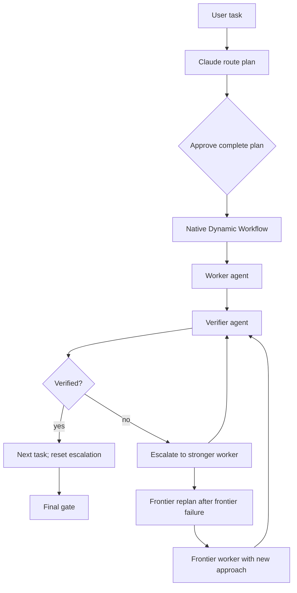

# Visible multi-model routing workflow

## Understanding

- Claude Code/Desktop is the primary interface.
- Before execution, Claude presents one route plan containing workers, providers, models, dependencies, verifiers, fallbacks, and expected spend.
- The complete plan is shown immediately before Claude's native Workflow approval card. With manual approval active, that card is the user's one execution confirmation. Claude auto mode may accept it through its classifier; switch out of auto mode when a mandatory manual click is required. A new approval is required only for a route outside the approved plan or a premium escalation.
- Every model invocation is represented by a visible Claude Dynamic Workflow agent whose prompt, tool calls, result, time, and Claude token use can be inspected.
- Every worker is followed by an independent verifier. Failed work escalates to a stronger model instead of ending the task.
- All agents use the worktree in which the Claude session started. The router does not create additional worktrees.
- Concurrency is derived from the task graph. There is no artificial router-level agent cap.

## Non-functional requirements

### Performance and scale

- Run independent workflow nodes concurrently and dependent nodes sequentially.
- Use a minimal Claude wrapper for external model calls.
- Pass compact failure and verification packets instead of entire conversation histories.
- Cache non-generating provider health checks and invalidate the cache on network or VPN errors.
- Support workflows with ten or more independent agents, subject only to native Claude Workflow, provider, and machine limits.

### Security and compliance

- Use official subscription clients and documented provider APIs only.
- Do not extract, copy, or repurpose browser cookies, OAuth credentials, or subscription tokens.
- Keep API keys in the existing protected local configuration. Never return them through MCP or write them to logs.
- Do not send `.env` files, credentials, production data, or unrelated repository content to workers.
- Require explicit approval for premium routes and material destructive actions.

### Reliability

- Validate the route DAG before launch.
- Require a verifier for every worker.
- Never hide retries inside MCP; every generation is a distinct visible workflow agent.
- Do not blindly replay an ambiguous timeout or a previously failed prompt.
- Escalate with a compact failure packet and a changed plan or stronger model.
- Mark only verified work complete.

### Maintenance and ownership

- Keep provider/model mappings in private local configuration behind stable aliases.
- Centralize routing, health, usage normalization, and premium gates in one local MCP server.
- Package Claude-specific orchestration as a Claude Code plugin while retaining a portable Agent Skill for Codex, OpenCode, and Warp.
- Store execution metadata outside project repositories.

## Architecture

The repository becomes a Claude Code plugin plus a portable compatibility skill.

1. The `/ai-router:workflow` skill inspects the task and current worktree and produces a structured `RoutePlan` in the main conversation. The command name includes Claude's human workflow opt-in keyword so the native `Workflow` tool is available.
2. A validator checks the plan before it is shown for approval.
3. A builder compiles the plan, and Claude's native Workflow approval card provides the one execution confirmation before any agents run.
4. Each external worker or verifier is a minimal Claude workflow agent that performs exactly one typed MCP delegation.
5. Native Claude workers use the selected Claude model directly and do not make an external delegation.
6. The MCP router records normalized usage metadata and returns it with the model result.
7. Claude `/workflows` remains the primary live progress and inspection UI. `/ai-router:usage` provides cross-provider accounting for routed calls.

## Route plan

`RoutePlan` is structured data rather than free-form prose. Each node contains:

- stable ID, objective, and expected artifact;
- role: `worker`, `verifier`, `repair`, `frontier-replanner`, or `final-gate`;
- primary provider/model alias, reasoning effort, and approved fallback aliases;
- dependencies and concurrency group;
- allowed paths and permission mode;
- acceptance criteria and deterministic checks;
- expected usage or cost estimate;
- escalation state and evidence inputs.

The validator rejects cyclic plans, unknown model aliases, workers without verifiers, unapproved premium routes, mismatches between declared task complexity and the initial route, ladders without a frontier fallback, and non-monotonic escalation paths.

## Execution and verification protocol

1. Select an initial worker based on task complexity. Do not force every task through the cheapest tier.
2. Run the worker as a visible workflow agent.
3. Give the verifier only the objective, relevant diff, worker claims, and deterministic check results.
4. Let the verifier inspect scope, run the strongest available oracle, and independently review correctness.
5. On failure, create a failure packet with the exact error, diff, attempted approach, and new evidence.
6. Route the task to a stronger model. Do not return a confirmed failure to the same weak model.
7. If a frontier worker fails, run a separate frontier replanner and then a new frontier worker with a materially different approach.
8. Continue while new evidence or approaches are available. Pause only for a real external blocker, unavailable providers, a required user decision, or new premium authorization.
9. On verification success, clear the escalation state. Route the next task independently from its own complexity.
10. At the final gate, run the complete verifier ladder before any repair. Never repair an all-review workflow; build repairs are limited to the original build-task paths. Existing worktree changes are the baseline, not a demand to clean or reset the tree.

## Model ladder

| Level | Default routes | Intended use |
|---|---|---|
| Local | shell, tests, formatters | Deterministic work without a model |
| Routine | Claude Haiku; Codex Luna/low; MiniMax; direct DeepSeek | Mechanical work with strong tests |
| Strong | corporate LiteLLM; Codex Terra/medium; Claude Sonnet/medium | Normal implementation, debugging, multi-file work |
| Frontier | Codex Sol/high; Claude Opus/high; Claude Best/high | Ambiguity, architecture, repeated failure; Best resolves to Fable when available and otherwise Opus |
| Specialist | Kimi K3 | Long-context or special cases with explicit approval |
| Backup | OpenRouter | Replacement transport when an adequate preferred route is unavailable |

When routes are equally adequate, prefer corporate LiteLLM, Codex, or available Claude subscription capacity; then MiniMax; then direct DeepSeek; and use OpenRouter only as backup. Model family and reasoning effort are explicit plan properties: the routed Codex aliases pin Luna/low, Terra/medium, or Sol/high, while native Claude pins Haiku/no-effort, Sonnet/medium, Opus/high, or Best/high. Reserve Best for the hardest frontier step; Claude Code resolves it to Fable when entitled and otherwise Opus. `codex` and `codex-high` remain compatibility aliases for Terra and Sol.

The cached health pass is deliberately non-generating. It verifies local clients, authentication, provider configuration, endpoint reachability, and selected API model visibility where the provider exposes it cheaply. Claude and Codex subscription clients do not expose a reliable zero-token entitlement probe for every tier, so exact entitlement is confirmed on the first approved generation; an unavailable tier becomes failure evidence and execution continues through the already approved ladder.

## Observability and accounting

Before approval, show each node's worker, provider/model, fallback, verifier, dependencies, and expected spend.

During execution:

- label every workflow agent with role, task ID, provider, and model;
- expose its prompt, recent tool calls, result, elapsed time, and Claude tokens through native workflow UI;
- return external provider input/output tokens and cost through MCP;
- record provider, model, timestamps, status, usage, verification verdict, and workflow reference in local JSONL state;
- never duplicate API keys or full prompts in the accounting log.

`/ai-router:usage` reports the current workflow, daily and weekly routed usage, provider call counts, and external API spend. Subscription reporting is limited to observable routed calls because Claude and Codex do not expose a reliable remaining-quota API.

## Error handling

- A failed health check uses only a fallback already present in the approved plan.
- A network error invalidates the cached health result before another attempt.
- An ambiguous post-send timeout is inspected for partial output and usage before any retry.
- A parse failure, repair, replan, retry, or escalation that requires a model creates a new visible agent.
- A premium or more expensive route outside the approved plan pauses for authorization.
- Closing Claude may prevent native cross-session workflow resume; persisted accounting remains available, but the plugin must not claim stronger resume guarantees than Claude provides.

## Packaging and interface

The Claude plugin provides:

- `/ai-router:workflow <task>`: guaranteed entry into plan, approval, workflow, verification, and escalation;
- `/ai-router:usage`: routed usage and cost summary;
- `/ai-router:doctor`: local configuration and non-generating provider checks;
- dynamically labelled worker, verifier, repair, final-gate, and frontier-replanner workflow agents;
- the local MCP router and route-plan validator.

The native `/workflows` command is the live workflow UI. An optional session-wide router supervisor may be provided, but it is not enabled globally by default. The portable Agent Skill remains available for non-Claude harnesses without promising Claude's native workflow UI.

## Acceptance strategy

1. Unit-test RoutePlan validation, verifier pairing, DAG checks, premium gates, escalation monotonicity, success reset, usage normalization, and health-cache invalidation.
2. Use mock providers for success, incorrect changes, verifier failure, pre-send and post-send timeout, partial usage, VPN failure, fallback, and repeated frontier failure.
3. Test generated workflows with sequential dependencies, independent branches, and ten parallel workers. Assert that no extra worktrees are created.
4. Run a real end-to-end smoke test in a small disposable Git repository:
   - approve a visible plan;
   - complete one cheap-worker to strong-verifier path;
   - complete one failed-worker to stronger-worker to verifier path;
   - inspect every agent through `/workflows`;
   - reconcile `/ai-router:usage` with provider usage.
5. Verify plugin installation, portable skill installation, file permissions, secret absence, and official authentication paths.

The plugin is ready only when both the direct-success and adaptive-escalation workflows complete successfully and remain fully inspectable in Claude Code/Desktop.

## Decision log

1. Use Claude Code/Desktop as the primary UI. A common native workflow UI across Claude, Codex, and OpenCode is not available.
2. Use Claude Dynamic Workflows rather than Agent Teams. Workflows provide a repeatable DAG and native drill-down; teams add coordination and token overhead that this protocol does not need.
3. Wrap every external model call in a minimal visible Claude workflow agent. Direct hidden MCP calls do not meet the observability requirement.
4. Require one approval for the complete plan. Require another only for routes outside that plan or premium escalation.
5. Use one existing session worktree. Do not create per-agent worktrees.
6. Do not impose an artificial concurrency cap. Derive parallelism from task independence and native runtime limits.
7. Verify every worker independently. Deterministic oracles outrank model agreement.
8. Escalate failed tasks instead of ending them. Reset escalation only after the current task is verified and the workflow advances.
9. Keep OpenRouter backup-only and Kimi K3 explicitly approved.
10. Make `/ai-router:workflow` the guaranteed entry point. A live test showed that `/ai-router:run` loaded the skill but did not expose Claude's opt-in-only `Workflow` tool, so the explicit workflow command name is required. Offer, but do not globally enable, a session-wide supervisor.

## References

- [Claude Code Dynamic Workflows](https://code.claude.com/docs/en/workflows)
- [Claude Code subagents](https://code.claude.com/docs/en/sub-agents)
- [Claude Code plugins](https://code.claude.com/docs/en/plugins)
